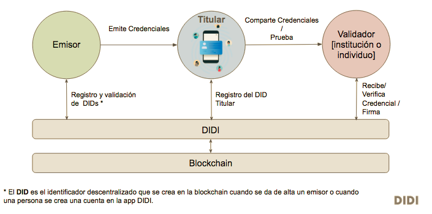

## ¿Qué es DIDI?

DIDI es una solución tecnológica de identidad digital descentralizada desarrollada en el marco del proyecto “Inclusión Cívica, Social  y Económica mediante modelos de Blockchain”, ejecutado por la A.C. DECODES en conjunto con BID Lab.

DIDI propone construir una identidad digital que certifique y valide datos sociales, cívicos y económicos, a través de la emisión de credenciales verificables, a partir de información certificada por terceros (instituciones o individuos). 

DIDI se materializa en la App Mobile ai·di (portadocumentos digital) y un portal web para la emisión y revocación de credenciales.

## ¿Por qué blockchain?
Blockchain o Cadena de bloques, puede ser entendido como un libro mayor contable (Ledger) o una base de datos en la que se registran múltiples transacciones. Es distribuido, es decir que se encuentra repartido en numerosas máquinas donde la información se encuentra replicada de forma idéntica, encriptada y verificada. Su tecnología de contabilidad distribuida (DLT), hace posible crear una identidad digital auto soberana que garantiza los requisitos de:
Privacidad: la información permanece protegida contra la divulgación no intencional
Control: el propietario de la identidad decide quién puede ver y acceder a sus datos y para qué propósitos
Portabilidad: el titular de los datos no se ata a un solo proveedor.

## ¿Cómo funciona DIDI?
La solución cuenta con una App Mobile, disponible para descarga por parte de quienes deseen gestionar sus credenciales formativo/laborales, transaccionales, patrimoniales y/o identitarias, entre otras.

Al crear una cuenta en la App DIDI, se genera un código de identificación que se conoce como DID (identificador descentralizado) el cual utiliza un protocolo de desafío/respuesta para probar la propiedad y permitir el uso de una identidad en particular a partir de la validación de datos biométricos con RENAPER (Registro Nacional de personas) y sobre el cual se asociará las credenciales verificables. 

Esta app se alimenta de credenciales emitidas por instituciones o entidades que deseen certificar información sobre el titular. Para esto, existe un módulo destinado a las entidades emisoras que cuenta con una solución backend y un portal web de emisión por el cual se podrá operar, gestionar, emitir y revocar credenciales.

Al dar de alta la solución para emisores en el servidor que este disponga,  se creará un DID al emisor, que será su identificador y por ende su firma al emitir una credencial.

Las credenciales verificables son medios por el cual podemos probar hechos sobre el propietarios de un DID, acreditando de manera digital y segura que una persona es portadora de ciertos atributos que tienen que ver con su identidad.

Una credencial verificable está compuesta por:
·	· DID del emisor (firma de la entidad emisora)
	· Datos del Titular (receptor) validados por el emisor
	· DID del Titular (receptor)

Usamos el protocolo de credenciales verificables de la identidad digital auto soberana (SSI) cuyos estándares fueron definidos por World Wide Web Consortium ([W3C](https://w3c.github.io/vc-data-model/)) , de manera que el usuario pueda resguardar su información de forma privada garantizando a su vez integridad de los datos y autenticidad de emisor.

## Alcance
La siguiente propuesta se basa en el caso de uso de la portabilidad de la reputación de los repartidores/mensajeros de plataformas P2P sobre DIDI. 
Para la correcta implementación de la misma, se deberán relevar las reglas e información que se emitirá dentro de las credenciales, de manera de poder identificar necesidades funcionales propias del modelo:
Tipos de credenciales (formativas, laborales)

Qué datos deberán contener las credenciales que se desea emitir de acuerdo a las decisiones operacionales, marco normativo, etc. (Por ejemplo: # de órdenes mensuales, tiempo conectado en la plataforma, kms recorridos, # cancelaciones acumuladas, criterios de reputación)
Cuáles son las reglas propias de negocio a fin de identificar la lógica por la que se emitirán y/o revocarán las credenciales. (Por ejemplo, periodicidad de emisión de las credenciales, actualización de la información, etc.

### Modelo de Emisión de Credenciales Verificables

## La emisión de las Credenciales
Existen dos vías posibles de emisión masiva de credenciales.

### Emisión Manual de Credenciales
Para la emisión de Credenciales Verificables, el primer paso del emisor será definir qué campos y datos queremos que contengan. Con estas definiciones se podrá dar de alta uno o más formatos de credencial en el portal web del emisor.

Desde el portal web del emisor se podrán emitir credenciales de forma manual y masiva mediante la carga de un archivo csv.

### Emisión Automática de Credenciales
--- armar ---

## Consideraciones Técnicas
Para evaluar los tiempos de desarrollo necesarios para avanzar en la emisión automática de credenciales se debe tener en cuenta que **DIDI proveerá**:

* Solución compuesta por el módulo emisor que deberá darse de alta en un servidor a cargo de la entidad emisora. Se contará con el código fuente y la documentación para una correcta implementación. (Se estima un tiempo de 3 a 4 horas) [ver [Arquitectura](www.didi.org.ar) para más detalle]

* API Issuer: utilizada para la creación, emisión y revocación de las credenciales.

* API DIDI: expone información necesaria desde la App DIDI para identificar al receptor final de las credenciales a emitir. Informa el DID asociado a un documento nacional de identidad (DNI).

El **emisor** deberá resolver:
* Definiciones funcionales según reglas de negocio y campos disponibles. Esto implica, entre otras cosas, lógicas de emisión de credenciales, periodicidad en los procesos de consulta, de emisión y de actualización de la información.
* Definición de qué tipos de credenciales se desea emitir (Por ejemplo: Formativas/historial laboral/reputacionales).
* Definición de campos que almacenará la credencial.
* Dimensionamiento del proceso según cantidad de consultas a efectuar en su base de datos, cantidad de datos y parámetros.
* Desarrollo API con campos/datos necesarios según lo relevado a integrar con solución DIDI.
* Desarrollo de proceso de creación de pre-credenciales (implica desarrollo de reglas de emisión/revocación) y guardado en DB del emisor. Así como, endpoint para recepcionar DNI-DID de API DIDI.

## Arquitectura
